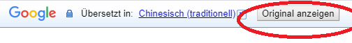
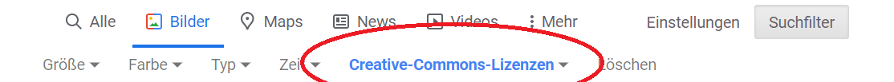
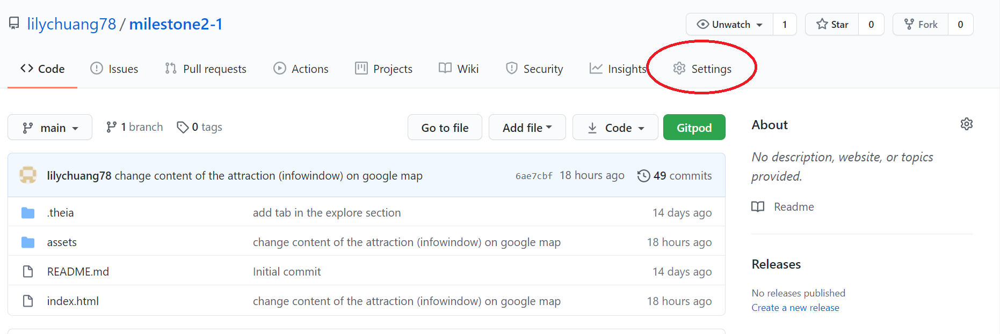
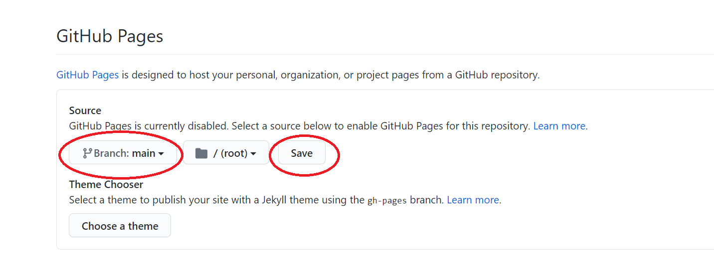
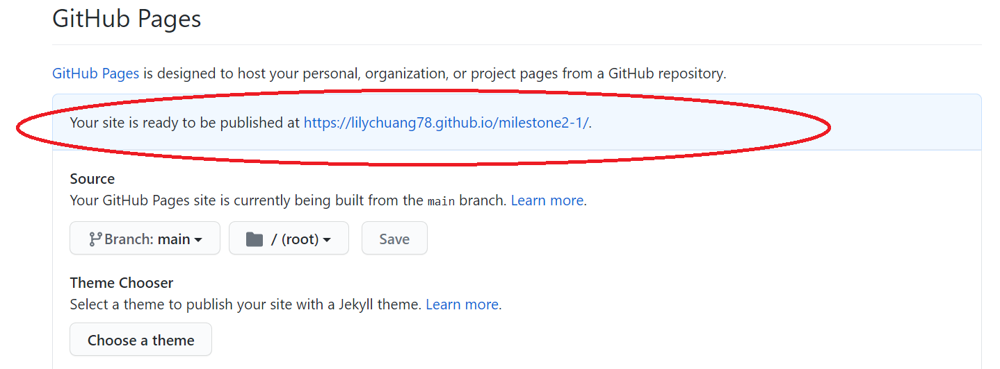

# #Discover Taiwan Website
You can find the deployed website [here](https://lilychuang78.github.io/milestone2-1/.). 
This website is to give a background information about Taiwan and trigger users' interest to want to visit Taiwan one day in the future. 
General information people might be interested are shown in the content. For instance, the location of Taiwan, climate, population, language, culture and business and such. 
For people who are further interested in visiting Taiwan, I believe cuisine and attraction are the most interesting topics people would want to find out. Therefore, there are two separte sections specifically for these purposes. 
The website is responsive and can be navigated within the website with different devices.

## User Stories
1. As a user, I want to navigate the website without problems.
2. As a user, I want to find out information about Taiwan.
3. As a user, I want to know what type of cuisines is famous in Taiwan.
4. As a user, I want to know what attractions and where in Taiwan are worth visiting.
5. As a user, I want to be able to leave a comment or question using a contact form.
6. As a user, I want to know if the website has external links to social media.

## Design
1. Hero images are presented with a slide show effect to attract user's attention and to display the scenery of Taiwan.
2. The white and tropical plant pattern background is chose to symbolize the warm and moise climate of Taiwan.
3. The navigation bar and background of sections are unified with white and grey colors to keep it simple and sophisticated.
4. Google font family "Castoro" is used as the font through out the website. When it is not available "serif" is replaced.

## Wireframe
The skeleton plane was created using Balsamiq Wireframes.

## Features
1. Navigation bar allows users to click and jump to different sections of the website without having to scroll down the pages. When the display is small as a smartphone, a drop down menu is displayed in the navigation bar.
2. Hero images are presented with a slide show effect to display different scenery of Taiwan so the user can have a picture in mind when they read through the website.
3. Info sections enables the users to know about Taiwan with genral information:
    - Location: an interactive Google map is presented so the users can move the map around themselves to corelate the location of Taiwan and the surrounding countries. A paragraph explaining where Taiwan is is also presented.
    - Climate: an interactive weather api is presented so the users can type in the cities in Taiwan to find out the real-time local temperature and weather. A paragraph about general climate information is also provided so the users can discover the general climate details in Taiwan.
    - Population: an interactive chart of population growth is presented so the users can move the cursor and see the exact population from 1951 to 2019 with a ten year interval. A detailed paragraph about the population, density, ancestory DNA and ethnicity is provided.
    - Language: a paragraph about languages people used in Taiwan is provided. A Google translation api is added in this section so the user can see how this website in traditional Chinese looks like. It is possible to convert the website back to English.
    - Culture: a Youtube video for the user to click and view is about aboriginal people's harvest festival. A detailed paragrah about various caulture backgrounds is provided.
    - Business: an interactive chart about Taiwan ranking the best Expat destination in 2019 by Expat Insider survey is presented, so the users can check what are the satisfication ration in comparison to the world average scores. A paragraph about big cooperation in Taiwan and why Taiwan is ranked number one in Expat Insider 2019 survay is explained.
4. Cusine section contains a genral information about why Taiwanese food is so special and it got the influences from different background through out the history. A disply of images are followed and the users are able to click and zoom in to see bigger pictures and the names of the cuisines.
5. Attraction section contains a big Google Map, the attractions sights are spread over the island. The most presentative places are shown with markers. When the users click on the marker, an info window is displayed with the name, an image and a short description of the place. A link to an external website called "Taiwan - The Heart of Aisa" is provided in case the users would like to search more details about certain attractions. THe users are able to click close of the info windows.
6. Contact section contains a form for the users to contact the website owner in order to leave a comment or a question. The place holder of message input changes after the users click submit button. An alert shows up when the email format is incorrect. [(see)](assets/images/readme/email_alert1.png)
7. The footer contains social media icons which allows the users to click and open external social media websites.
8. A go-to-the top icon is on the right bottom coner, which allows the user to go back to the top without having the scroll all the way up.
8. Responsive design are used with Bootstrap grid through out the website to adapt different size of devices.

## Development Tools
### Languages
1. HTML: HTML5 is used to structure the website.
2. CSS: it is widely use to style the website.
3. Javascript: it is used for interactive purpose of the website.
### Libraries
1. Bootstrap 4.0.0: Bootstrap class are used through out the website. Bootsrap grid is used to implement responsive display on different devices.
2. [FANCYBOX](https://fancyapps.com/fancybox/3/): it is used to display cuisine images and allows the users to click to see a bigger picture. It is also used to allow the users to click and view a youtube video in the section "Info", subsection of "Culture".  
3. Font Awesome: it is used to import icons including go-to-top and social media icons.
4. Google Fonts: Google fonts "Castoro" is imported.
5. Google Maps: Google Map API is implemented to display maps, customized marker, and info windows in one of the maps.
6. Google Translation: Google Translation API is implemented with an option of traditional Chinese so the users can discover how traditional Chinese looks like. It is possible to switch back to English by clicking "show original".
7. jQuery: it is used to allow the users to go to the top of the page by clicking a double up icon.
8. [OpenWeather](https://openweathermap.org/): it is used to allow the users to search real time weather in the section of "Info", subsection "Climate".
### Other
1. Balsamiq Wireframes: it is used to design the wirefram of the website.
2. [BeutifyTools](http://beautifytools.com/): it is used to beautify the code structure of html, css and js files.
3. Github: it is used to store the code and deploy the website to the internet.
4. Gitpod: it is used to write the code and add, commit and push to the Github by using git commands. Also it is used to preview the website temporarily.
5. Google Chrome Developer Tool: it is used to temporarily test and design the structure and style of the website.
6: [Unsplash](https://unsplash.com/): Images are taken from Unsplash with credit written.
7: Wikipedia: general information are taken from Wikipeida website.
8: Google Image: some images are taken from Google Image which are filtered with "creative common license". 

## Testing
1. [WC3 Validation](https://validator.w3.org/) is used to examine whether there is any HTML and CSS syntax error with "input by text" option. See the validation of [HTML](assets/images/readme/html_checker.png) and [CSS](assets/images/readme/css_checker.png).
2. User Stories
    1. I am able to navigate through the website using navigation bar.
    2. General information about Taiwan can be found when clicking on the "Info" in the navigation bar.
    3. Different information is found by clicking on the tab menu of "Location, Climate, Population, Language, Culture and Business".
        - In Loaction section, a map can be zoomed in or out and moved around to see where Taiwan is co-relate to my current location [(see)](assets/images/readme/location_map.png).
        - In Climate section, a city name such as Taipei can be entered and the real time weather is displayed [(see)](assets/images/readme/search_weather.png).
        - In Population section, the exact number of population when moving the cursor to the dot of the chart is showned [(see)](assets/images/readme/population.png).
        - In Language section, the website can be translated using Google translation with traditional Chinese option. [(see)](assets/images/readme/translation1.png) And the website can be reverted back to English by clicking "show original" [(see)](assets/images/readme/translation2.png). The automatically appeared bar can be removed by clicking x icon.
        - In Culture section, a youtube video is able to be played by clicking on the image [(see)](assets/images/readme/video.png). And I am able to close the video by clicking x icon.
        - In Business section, both Taiwan and Global scores in Expat Insider survey in the chart can be displayed when the cursor hovers over [(see)](assets/images/readme/business.png).
    4. Cuisines images can be zoom in. The names of the cuisines are displayed after zooming in.
    5. In Attraction section, markers of the Google Map are clickable. An info window shows up with image and description [(see)](assets/images/readme/infowindow.png). A link is provided to link to an external website and opens a seperate webpage. The info window can be closed by clicking the x icon.
    6. The contact form can be used only when all the input sections are all filled and with a correct formatted email, then the form can be sent. Otherwise, there are alerts which reminds the users. [See](assets/images/readme/email_alert1.png) and [here](assets/images/readme/email_alert2.png) of the alerts.   
    7. The social media icons can link to sepearte webpage of the social media website, instead of replacing the current webpage.
3. Lighthouse, a Google Chrome extension was downloaded and is used to test the accsibility [(see)](assets/images/readme/lighthouse.png).
4. Google Chrome Developer Tool was used to test whether the website is displayed as wished in different devices including smartphone, ipad and responsive desktops.

## Deployment
1. In the Github repository of [milestone2-1](https://github.com/lilychuang78/milestone2-1), click on "Setting".
2. In the section of GitHub Pages and subsection of "Source", select "main" as branch and save.
3. The page is refreshed. Go back to the section of GitHub Pages and find the deployed address. 

## Credit
### Code
1. The code of hero image slide show is refered from [CSS Tricks](https://css-tricks.com/snippets/jquery/simple-auto-playing-slideshow/).
2. The code of cuisne images zooming in is refered from [CodePen](https://codepen.io/fancyapps/pen/vzoPMB?editors=1010*/).
3. The code of google maps
    - In Location section is refered from [Google Maps Platform](https://developers.google.com/maps/documentation/javascript/overview)
    - In Attraction section is refered from the tutorial of Eamonn Smyth ["How to google maps"](https://code-institute-room.slack.com/files/UU5GBNS6M/F01DRAEPEH5/how_to_google_maps.pdf).
4. The code of OpenWeather API is refered from [CodePen](https://codepen.io/tutsplus/details/gObLaEP) and [envatotuts+](https://webdesign.tutsplus.com/tutorials/build-a-simple-weather-app-with-vanilla-javascript--cms-33893).
5. The code of Google Translation API is refered from [w3school](https://www.w3schools.com/howto/howto_google_translate.asp).
6. The code of go-back-to-top button is refered from [w3school](https://www.w3schools.com/howto/howto_js_scroll_to_top.asp).
### Content
1. The data of population is refered from [Departement of Hosuehold Registration, Taiwan](https://www.ris.gov.tw/app/portal/346).
2. The data of Expat Insider 2019 is refered from [InterNations](https://www.internations.org/press/press-release/expat-insider-2019-survey-reveals-the-best-and-worst-destinations-to-live-and-work-in-2019-39881).
3. General information is partially taken from [Wikipedia English](https://en.wikipedia.org/wiki/Main_Page) and [Wikipedia Chinese](https://zh.wikipedia.org/wiki/Wikipedia:%E9%A6%96%E9%A1%B5).
### Media
1. Images are taken from
    - [Unsplash](https://unsplash.com/)
    - [Wikipedia English](https://en.wikipedia.org/wiki/Main_Page) and [Wikipedia Chinese](https://zh.wikipedia.org/wiki/Wikipedia:%E9%A6%96%E9%A1%B5)
    - [Google Images](https://images.google.de/) filterd with creative common license 
### Other
1. I also want to thank CodeInstitute online tutors and my mentor Spencer for the technical help and ideas.